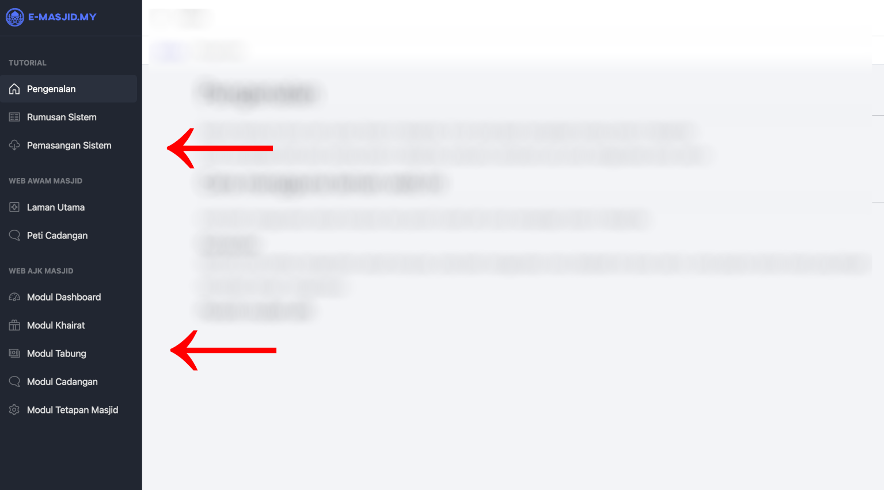
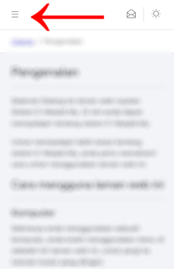

# Pengenalan

Selamat Datang ke laman web rujukan Sistem E-Masjid.My. Di sini anda dapat mempelajari tentang sistem E-Masjid.My.

Untuk mempelajari lebih lanjut tentang sistem E-Masjid.My, anda perlu memahami cara untuk menggunakan laman web ini.

# Cara menggunakan laman web ini

## Komputer

Sekiranya anda menggunakan komputer, anda boleh menggunakan menu di sebelah kiri laman web ini, untuk pergi ke tutorial modul yang diingini.



## Peranti mudah alih

Sekiranya anda menggunakan peranti mudah alih, laman web ini akan diperkecilkan untuk menyesuaikan saiz paparan peranti anda.

Untuk pergi ke tutorial yang diingini, anda boleh klik ke butang yang berada di sebelah atas kiri laman web ini.



# Contoh code block

```go
package main

import (
	"os"

	"github.com/gomarkdown/markdown"
	"github.com/gomarkdown/markdown/ast"
	"github.com/gomarkdown/markdown/html"
	"github.com/gomarkdown/markdown/parser"

	"fmt"
)

var mds = `# header

Sample text.

[link](http://example.com)
`

func mdToHTML(md []byte) []byte {
	// create markdown parser with extensions
	extensions := parser.CommonExtensions | parser.AutoHeadingIDs | parser.NoEmptyLineBeforeBlock
	p := parser.NewWithExtensions(extensions)
	doc := p.Parse(md)

	// create HTML renderer with extensions
	htmlFlags := html.CommonFlags | html.HrefTargetBlank
	opts := html.RendererOptions{Flags: htmlFlags}
	renderer := html.NewRenderer(opts)

	return markdown.Render(doc, renderer)
}

func main() {
	md := []byte(mds)
	html := mdToHTML(md)

	fmt.Printf("--- Markdown:\n%s\n\n--- HTML:\n%s\n", md, html)
}
```