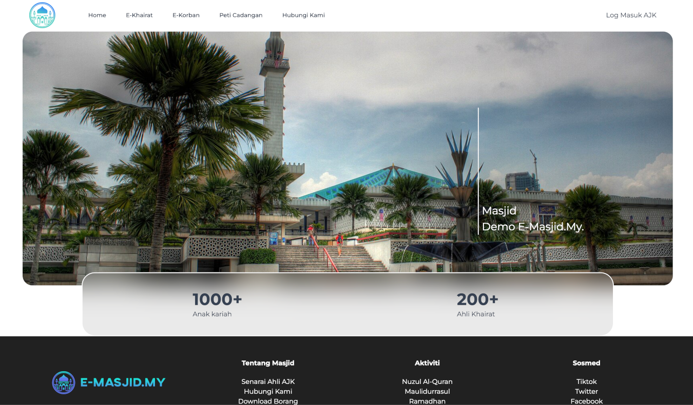
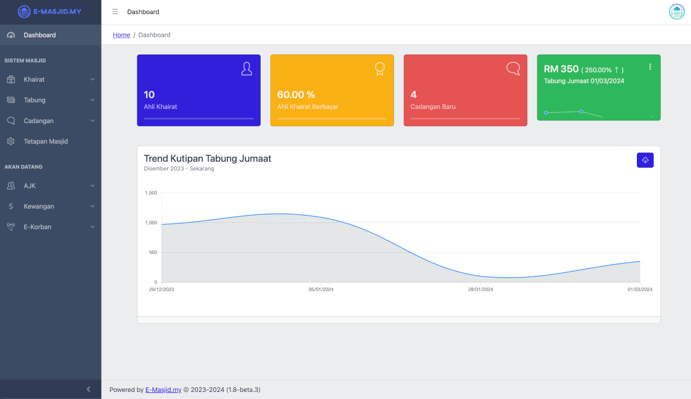

# Rumusan Sistem

Sistem E-Masjid.My mengandungi dua komponen, iaitu Web Awam Masjid dan Web AJK Masjid.

## Web Awam Masjid

Web Awam Masjid adalah digunakan untuk menyediakan informasi semasa tentang masjid kepada anak kariah.

Ia juga boleh digunakan untuk mendapatkan maklumat dari anak kariah.

Berikut adalah contoh paparan web awam masjid.

## Web AJK Masjid

Web AJK Masjid adalah digunakan oleh pihak masjid.

Berikut adalah contoh paparan web AJK masjid.

